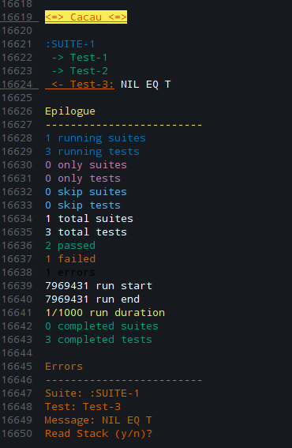
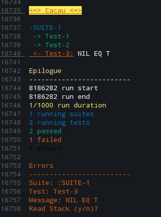

# cacau
 
<p align="center">
  
</p>

## <a name="read-in-other-languages">Read in other languages</a>

Read this in other languages: [English](https://github.com/noloop/cacau/blob/master/README.md),
[Portuguese-br](https://github.com/noloop/cacau/blob/master/README.pt-br.md)

## <a name="quickstart">Quickstart</a>

```lisp
(defpackage #:cacau-examples-quickstart
  (:use #:common-lisp
        #:assert-p
        #:cacau))
(in-package #:cacau-examples-quickstart)

(deftest "Test-1" () (eql-p 1 1))
(deftest "Test-2" () (eql-p 2 2))
(deftest "Test-3" () (eql-p 3 3))

(run :colorful t)
```

And you get the output of the reporter `:min` that is the default of the cacacau:


There are also others [reporters](#reporters).

See that the cacau returned `T`, this happened because none test failed, when there are tests failing or errors (errors
of hooks by example) it's returned `NIL`.

## 
## <a name="getting-started">Getting Started in cacau</a>

### <a name="summary">Summary</a>
* [cacau](#cacau)
  * [Read in other languages](#read-in-other-languages)
  * [Quickstart](#quickstart)
  * [Getting started in cacau](#getting-started)
    * [Summary](#summary)
    * [Portability](#portability)
    * [Dependencies](#dependencies)
    * [Download and Load](#download-and-load)
    * [Funcionalities](#functionalities)
      * [Suites](#suites)
      * [Hooks](#hooks)
        * [before all](#before-all)
        * [before each](#before-each)
        * [after each](#after-each)
        * [after all](#after-all)
        * [hooks in :suite-root](#hooks-in-suite-root)
        * [before/after each inheritance](#before-after-each-inheritance)
      * [Only and Skip](#only-and-skip)
        * [run only tests/suites](#onlys)
        * [skip tests/suites](#skips)
        * [precedence order "skip -> only"](#skip-only-rules)
      * [Timeout](#timeout)
        * [defining suite timeout](#timeout-suites)
        * [defining hook timeout](#timeout-hooks)
        * [defining test timeout](#timeout-tests)
      * [Test asynchronous code](#async-test)
      * [Interfaces](#interfaces)
        * [cl](#cl)
        * [bdd](#bdd)
        * [tdd](#tdd)
        * [no-spaghetti](#no-spaghetti)
      * [Cacau with colors](#cacau-with-colors)
      * [Reporters](#reporters)
        * [min](#min)
        * [list](#list)
        * [full](#full)
      * [Enabling cl-debugger](#enabling-cl-debugger)
      * [Run hooks](#run-hooks)
  * [Cacau with colors in SLIME](#cacau-with-colors-in-slime)
  * [ASDF integration](#asdf-integration)
  * [Contributing](#contributing)
  * [TODO](#todo)
  * [API](#api)
  * [LICENSE](#license)

### <a name="portability">Portability</a>

I just tested on Linux using SBCL, coming soon I will writer tests for the others platforms using some CI tool.

### <a name="dependencies">Dependencies</a>

[:eventbus](https://github.com/noloop/eventbus)
[:assertion-error](https://github.com/noloop/assertion-error)

### <a name="download-and-load">Download and Load</a>

**1 - Load cacau system by quicklisp**

```
IN PROGRESS...
```

**2 - Download and load cacau system by github and asdf**

download from github:

```
git clone https://github.com/noloop/cacau.git
```

and load by asdf:

```lisp
(asdf:load-system :cacau)
```

**Note: Remember to configure asdf to find your directory where you downloaded the libraries (asdf call them "systems")
 above, if you do not know how to make a read at:**
 
 https://common-lisp.net/project/asdf/asdf/Configuring-ASDF-to-find-your-systems.html 
 
 **or**
 
 https://lisp-lang.org/learn/writing-libraries


## <a name="assertions">Assertions</a>

The cacau was built to be independent of assertions systems, is true 
that in Common Lisp we don't have many systems of assertions, but I'm 
trying with the cacau create this pattern so it can make it easier to use 
of one some assertion system in many different test runner systems.
So the user stay free to choice what more please you.
I built the assertion system [:assert-p](https://github.com/noloop/assert-p),
and in the example [quickstart](examples/cacau-examples-quickstart.lisp) 
I use both systems together to create the tests.

Is simple, there is the `:cacau` test runner system and the `:assert-p` assertion 
system, when there is one assertion fail is throw one 
[:assertion-error](https://github.com/noloop/assertion-error) 
that is caught and stored by `:cacau` it to give the end result of the 
tests race.

With this is easier emerge new assertions systems for specific cases 
or aiming different syntax, which the `:cacau` can works with them.

## <a name="functionalities">Functionalities</a>

### <a name="suites">Suites</a>

You can organize your tests in suites:

```lisp
(defpackage #:cacau-examples-suites
  (:use #:common-lisp
        #:assert-p
        #:cacau))
(in-package #:cacau-examples-suites)

(defsuite :suite-1 ()
  (deftest "Test-1" () (t-p t))
  (deftest "Test-2" () (t-p t)))

(defsuite :suite-2 ()
  (let ((x 0))
    (deftest "Test-1" () (eql-p x 0))
    (deftest "Test-2" () (t-p t))
    (defsuite :suite-3 ()
      (deftest "Test-1" () (t-p t))
      (deftest "Test-2" () (t-p t)))))

(run)
```

The cacau test runner it has one `:suite-root`, so always that you call the 
function `(run)` a new runner is created with one new `:suite-root`.

### <a name="hooks">Hooks</a>

The order of execution of the hooks follow the topics order below, 
thus is executed:

1. before-all hook
2. before-each hook
3. after-each hook
4. after-all hook

#### <a name="before-all">before all</a>

Do something before all tests of one suite.

```lisp
(defpackage #:cacau-examples-hooks
  (:use #:common-lisp
        #:assert-p
        #:cacau))
(in-package #:cacau-examples-hooks)

(defsuite :suite-with-before-all ()
  (let ((x 0))
    (defbefore-all "Before-all" () (setf x 1))
    (deftest "Test-1" () (eql-p x 1))
    (deftest "Test-2" () (eql-p x 1))))
    
(run)
```

#### <a name="before-each">before each</a>

Do something before each test of one suite.

```lisp
(defpackage #:cacau-examples-hooks
  (:use #:common-lisp
        #:assert-p
        #:cacau))
(in-package #:cacau-examples-hooks)

(defsuite :suite-with-before-each ()
  (let ((x 0))
    (defbefore-each "Before-each" () (setf x 1))
    (deftest "Test-1" () (eql-p x 1))
    (deftest "Test-2" () (eql-p x 1))))
    
(run)
```

#### <a name="after-each">after each</a>

Do something after each test of one suite.

```lisp
(defpackage #:cacau-examples-hooks
  (:use #:common-lisp
        #:assert-p
        #:cacau))
(in-package #:cacau-examples-hooks)

(defsuite :suite-with-after-each ()
  (let ((x 0))
    (defafter-each "After-each" () (setf x 1))
    (deftest "Test-1" () (eql-p x 0))
    (deftest "Test-2" () (eql-p x 1))))
    
(run)
```

#### <a name="after-all">after all</a>

Do something after all tests of one suite.

```lisp
(defpackage #:cacau-examples-hooks
  (:use #:common-lisp
        #:assert-p
        #:cacau))
(in-package #:cacau-examples-hooks)

(defsuite :suite-with-after-all ()
  (let ((x 0))
    (defafter-all "After-all" () (setf x 1))
    (deftest "Test-1" () (eql-p x 0))
    (deftest "Test-2" () (eql-p x 0))))
    
(run)
```

#### <a name="hooks-in-suite-root">hooks in :suite-root</a>

For use hooks in `:suite-root` it's as simple as call the hooks functions 
without be inside of some suite:

```lisp
(defpackage #:cacau-examples-hooks
  (:use #:common-lisp
        #:assert-p
        #:cacau))
(in-package #:cacau-examples-hooks)

(defbefore-all "Before-all" () (print ":suite-root's before-all"))
(defbefore-each "Before-each" () (print ":suite-root's before-each"))
(defafter-each "After-each" () (print ":suite-root's after-each"))
(defafter-all "After-all" () (print ":suite-root's after-all"))

(defsuite :suite-1 ()
  (deftest "Test-1" () (t-p t))
  (deftest "Test-2" () (t-p t)))
  
(run)

```
#### <a name="before-after-each-inheritance">Before/after each inheritance</a>

The hooks that execute something before or after of one suite are executed 
only once time, and only at that suite.

However the hooks that execute something before or after each test are 
inherited, by example, if one dad suite of name `:suite-1` has one hook 
for execute something before each test, and this suite have one daughter 
suite called `:suite-2`, that also has one hook for execute something before 
each test, so, when run the tests of the `:suite-1` only the your hook will 
be executed, but when run the tests of the `:suite-2`, will be executed the 
first hook of the dad suite and after the hook of the daughter suite.
See one example for better understanding:

```lisp
(defpackage #:cacau-examples-hooks
  (:use #:common-lisp
        #:assert-p
        #:cacau))
(in-package #:cacau-examples-hooks)

(defsuite :suite-1 ()
  (defbefore-each "Before-each Suite-1" ()
    (print "run Before-each Suite-1"))
  (deftest "Test-1" () (print "run Test-1") (t-p t))
  (defsuite :suite-1 ()
    (defbefore-each "Before-each Suite-2" ()
      (print "run Before-each Suite-2"))
    (deftest "Test-1" () (print "run Test-2") (t-p t))))
    
(run)
```

This will print:

```lisp
"run Before-each Suite-1" 
"run Test-1" 
"run Before-each Suite-1" 
"run Before-each Suite-2" 
"run Test-2" 
```

For more understanding see the file of [hooks examples](examples/cacau-examples-hooks.lisp).

Be aware that when hooks throw errors with except of the extrapolated 
timeout error, they are going to abort the tests race and the result 
will be give. This happens because the cacau think that for the tests 
be run correctly before should whole your configured hooks be run 
correctly.

### <a name="only-and-skip">Only and Skip</a>

You can want run some tests in isolation or skip some tests for sometime.
With the cacau you can do this, and you can isolate or skip both suites and tests.

#### <a name="onlys">run only tests/suites</a>

```lisp
(defpackage #:cacau-examples-onlys
  (:use #:common-lisp
        #:assert-p
        #:cacau))
(in-package #:cacau-examples-onlys)

(defsuite :suite-1 ()
  (deftest "Test-1" (:only) (t-p t))
  (deftest "Test-2" () (t-p t)))

(defsuite :suite-2 ()
  (let ((x 0))
    (deftest "Test-1" () (eql-p x 0))
    (deftest "Test-2" () (t-p t))
    (defsuite :suite-3 (:only)
      (deftest "Test-1" () (t-p t))
      (deftest "Test-2" () (t-p t)))))

(run)
```
With the code above three tests are executed: The "Test-1" of the 
"Suite-1", and both the tests of the "Suite-3".

#### <a name="skips">skip tests/suites</a>

```lisp
(defpackage #:cacau-examples-skips
  (:use #:common-lisp
        #:assert-p
        #:cacau))
(in-package #:cacau-examples-skips)

(defsuite :suite-1 ()
  (deftest "Test-1" (:skip) (t-p t))
  (deftest "Test-2" () (t-p t)))

(defsuite :suite-2 (:skip)
  (let ((x 0))
    (deftest "Test-1" () (eql-p x 0))
    (deftest "Test-2" () (t-p t))
    (defsuite :suite-3 ()
      (deftest "Test-1" () (t-p t))
      (deftest "Test-2" () (t-p t)))))

(run :colorful t)
```

With the code above just the "Test-2" of the "Suite-1" is executed.

#### <a name="skip-only-rules">precedence order "skip -> only</a>

The rule is simple:

The tests or suites `skip` have precedence to tests or suites `only`.
See one example:

```lisp
(defpackage #:cacau-examples-skips-onlys-rules
  (:use #:common-lisp
        #:assert-p
        #:cacau))
(in-package #:cacau-examples-skips-onlys-rules)

(defsuite :suite-1 (:only)
  (deftest "Test-1" () (t-p t)) ;; run!
  (deftest "Test-2" () (t-p t)) ;; run!
  (defsuite :suite-2 (:skip)
    (deftest "Test-1" () (t-p t))
    (deftest "Test-2" () (t-p t))))
(run :colorful t)
```

You can want see the file of the [examples of skip->only rule](examples/cacau-examples-skips-onlys-rules.lisp) for 
better comprehension.

### <a name="timeout">Timeout</a>

You can define one limit time for your tests, suites and hooks.
Read with attention the topics below, because there are differences 
between the three possibilities.

#### <a name="timeout-suites">defining suite timeout</a>

When define one timeout for one suite, this will make with that 
all tests of that suite acquire the same timeout of that suite.

```lisp
(defpackage #:cacau-examples-timeout
  (:use #:common-lisp
        #:assert-p
        #:cacau))
(in-package #:cacau-examples-timeout)

(defsuite :suite-1 ((:timeout 0))
  (deftest "Test-1" () (t-p t)) ;; Timeout Error: Time(0) extrapolated!
  (deftest "Test-2" () (t-p t))) ;; Timeout Error: Time(0) extrapolated!
  
(run)
```

#### <a name="timeout-hooks">defining hook timeout</a>

When define one timeout for one hook, this limit timeout only will 
have importance for the hook configured.
When there are timeout fail the tests race will not aborted, 
as happen when hooks fail for throw of any others errors.

```lisp
(defpackage #:cacau-examples-timeout
  (:use #:common-lisp
        #:assert-p
        #:cacau))
(in-package #:cacau-examples-timeout)

(defsuite :suite-1 ()
  (defbefore-all "Before-all" ((:timeout 0))) ;; Timeout Error: Time(0) extrapolated!
  (deftest "Test-1" () (t-p t))
  (deftest "Test-2" () (t-p t)))
          
(run)
```

#### <a name="timeout-tests">defining test timeout</a>

When define one timeout for the one test, this limit time only 
have importance for the test configured.
When there are timeout fail the tests race will not aborted.

```lisp
(defpackage #:cacau-examples-timeout
  (:use #:common-lisp
        #:assert-p
        #:cacau))
(in-package #:cacau-examples-timeout)

(defsuite :suite-1 ()
  (deftest "Test-1" ((:timeout 0)) (t-p t)) ;; Timeout Error: Time(0) extrapolated!
  (deftest "Test-2" () (t-p t)))

(run)
```

If the test or suite are inside the some suite that already has 
configured with one timeout, the same is ignored, and what predominate 
is the timeout of the test or suite daughter that was configured.

```lisp
(defpackage #:cacau-examples-timeout
  (:use #:common-lisp
        #:assert-p
        #:cacau))
(in-package #:cacau-examples-timeout)

(defsuite :suite-1 ((:timeout 0))
  (deftest "Test-1" () (t-p t))   ;; Timeout Error: Time(0) extrapolated!
  (deftest "Test-2" () (t-p t))   ;; Timeout Error: Time(0) extrapolated!
  (defsuite :suite-2 ((:timeout 50000))
    (deftest "Test-1" ((:timeout 0)) (t-p t)) ;; Timeout Error: Time(0) extrapolated!
    (deftest "Test-2" () (t-p t))))

(run)
```

You can want see the file of the [examples of timeout](examples/cacau-examples-timeout.lisp) for 
better comprehension. 

### <a name="async-test">Test asynchronous code</a>

You may need test some asynchronous code, and the cacau was built in 
a way to wait each test before the next execution test. 
You will need call one `done` function and also tell to cacau which 
test or hook is asynchronous. See one example of as write one test 
to test your async code:

```lisp
(defpackage #:cacau-examples-async-test
  (:use #:common-lisp
        #:assert-p
        #:cacau))
(in-package #:cacau-examples-async-test)

(defsuite :suite-1 ()
  (deftest "Test-1" ((:async done))
    (funcall done))
  (deftest "Test-2" () (t-p t)))
  
  (run)
```

Above is configured one test passing `(:async done)` as configurations, 
where `done` is the name of the function that you need call for the 
test be end, you can give to `done` any name that wish, by example:

```lisp
(deftest "Test-1" ((:async something))
    (funcall something))
```

Attention for that if you don't call `done` or the name that you choice, 
the cacau going to waits forever by the call. So you will not want 
forget of call `done` for end your test.

Can be passed three types of different arguments for the `done` 
function, it accept one `assertion-error`, one `error`, or one `lambda`. 
This is useful for you catch assertion errors. By example, passing 
one `assertion-error`:

```lisp
(defpackage #:cacau-examples-async-test
  (:use #:common-lisp
        #:assert-p
        #:cacau))
(in-package #:cacau-examples-async-test)

(deftest "Test-1" ((:async done))
      (handler-case (t-p nil)
        (error (c)
          (funcall done c))))
          
 (run)
```

Or passing one function `lambda` where you can call assertion functions 
that will be catches by cacau, as in the tests to test synchronous things:

```lisp
(defpackage #:cacau-examples-async-test
  (:use #:common-lisp
        #:assert-p
        #:cacau))
(in-package #:cacau-examples-async-test)

(deftest "Test-2" ((:async done))
      (funcall done (lambda () (t-p t))))
          
 (run)
``` 

You can want see the file of the [examples of async test](examples/cacau-examples-async-tests.lisp) for 
better comprehension. 

### <a name="interfaces">Interfaces</a>

The cacau was built in a way support the create new interfaces, so 
you can use whichever you prefer, or even contribute with the cacau 
project building one new interface.

You don't need setting nothing or passing nothing when call `(run)` to 
use some interface. All interfaces are available for you use whichever 
you wish, and until mix them, but I don't recommend do this, keep one 
pattern, and use just one interface for better readability of the code.

#### <a name="cl">cl</a>

This interface was one that was used in the examples above. 
It works by define suites inside others suites, and provides the macros:

```lisp
(defsuite name options &body body)
(defbefore-all name options &body body)
(defbefore-each name options &body body)
(defafter-each name options &body body)
(defafter-all name options &body body)
(deftest name options &body body)
```

The `options` parameter receive one list that should have zero or more 
of the following items, in the hooks:

```lisp
((:async done) (:timeout 0))
```

in `defsuite` or `deftest`:

```lisp
(:skip :only (:async done) (:timeout 0))
```

See one example of use:

```lisp
(defpackage #:cacau-examples-interfaces
  (:use #:common-lisp
        #:assert-p
        #:cacau))
(in-package #:cacau-examples-interfaces)
  
(defsuite :suite-1 ()
  (let ((x 0))
    (defbefore-all "Before-all Suite-1" () (setf x 1))
    (defbefore-each "Before-each Suite-1" () (setf x 0))
    (defafter-each "After-each Suite-1" () (setf x 1))
    (defafter-all "After-all Suite-1" ((:async done))
      (setf x 1)
      (funcall done))
    (deftest "Test-1" () (eql-p x 0))
    (deftest "Test-2" ()
      (funcall done (lambda () (eql-p x 0))))))

(run)
```

#### <a name="bdd">bdd</a>

This interface works by define suites inside others suites, but no 
is provide macros, it provides functions that need of the use 
of `lambda`.

```lisp
(before-all name fn &key async (timeout -1))
(before-each name fn &key async (timeout -1))
(after-each name fn &key async (timeout -1))
(after-all name fn &key async (timeout -1))
(context name fn &key only skip (timeout -1))
(it name fn &key async only skip (timeout -1))
```

See one example of use:

```lisp
(defpackage #:cacau-examples-interfaces
  (:use #:common-lisp
        #:assert-p
        #:cacau))
(in-package #:cacau-examples-interfaces)

(context
 "Suite-1"
 (lambda (&optional (x 0))
   (before-all "Before-all Suite-1" (lambda () (setf x 1)))
   (before-each "Before-each Suite-1" (lambda () (setf x 1)))
   (after-each "After-each Suite-1" (lambda () (setf x 1)))
   (after-all "After-all Suite-1" (lambda (done) (funcall done)) :async t)
   (it "Test-1" (lambda () (eql-p x 1)))
   (it "Test-2" (lambda () (incf x) (eql-p x 2)))
   (context
    "Suite-2"
    (lambda (&optional (x 0))
      (it "Test-1" (lambda () (incf x) (eql-p x 1)))
      (it "Test-2" (lambda () (eql-p x 1)))))))
      
(run)
```

#### <a name="tdd">tdd</a>

This interface works by define suites inside others suites, but no 
is provide macros, it provides functions that need of the use 
of `lambda`.

```lisp
(suite-setup name fn &key async (timeout -1))
(suite-teardown name fn &key async (timeout -1))
(test-setup name fn &key async (timeout -1))
(test-teardown name fn &key async (timeout -1))
(suite name fn &key only skip (timeout -1))
(test name fn &key async only skip (timeout -1))
```

See one example of use:

```lisp
(defpackage #:cacau-examples-interfaces
  (:use #:common-lisp
        #:assert-p
        #:cacau))
(in-package #:cacau-examples-interfaces)

(suite
 "Suite-1"
 (lambda (&optional (x 0))
   (suite-setup "Suite-setup Suite-1" (lambda () (setf x 1)))
   (test-setup "Test-setup Suite-1" (lambda () (setf x 1)))
   (test-teardown "Test-teardown Suite-1" (lambda () (setf x 1)))
   (suite-teardown "Suite-teardown Suite-1" (lambda (done) (funcall done)) :async t)
   (test "Test-1" (lambda () (eql-p x 1)))
   (test "Test-2" (lambda () (incf x) (eql-p x 2)))
   (suite
    "Suite-2"
    (lambda (&optional (x 0))
      (test "Test-1" (lambda () (incf x) (eql-p x 1)))
      (test "Test-2" (lambda () (eql-p x 1)))))))
      
(run)
```

#### <a name="no-spaghetti">no-spaghetti</a>

This interface works by without define suites inside others suites, 
it works on the serial way and provide the macros:

```lisp
(defbefore-plan name options &body body)
(defbefore-t name options &body body)
(defafter-t name options &body body)
(defafter-plan name options &body body)
(in-plan name &optional (options ()))
(deft name &optional (options ()))
```

The `options` parameter receive one list that should have zero or more 
of the following items, in the hooks:

```lisp
((:async done) (:timeout 0))
```

in `in-plan`:

```lisp
(:skip :only (:async done) (:timeout 0) (:parent :suite-name))
```

and in `deft`:

```lisp
(:skip :only (:async done) (:timeout 0))
```

This works like this to avoid that you need specify who is the father 
suite of each test that you write. When you call `in-plan`, whole next 
calls of `deft` or hooks calls will have this suite as father, until 
you call other `in-plan`.

See one example of use:

```lisp
(defpackage #:cacau-examples-interfaces
  (:use #:common-lisp
        #:assert-p
        #:cacau))
(in-package #:cacau-examples-interfaces)

(let ((x 0))
  (in-plan :suite-1 ()) ;; or (in-suite :suite-1 ((:parent :suite-root)))
  (defbefore-plan :before-plan-suite-1 () (setf x 1))
  (deft :test-1 () (eql-p x 1))
  (deft :test-2 ((:async done))
    (incf x)
    (funcall done (lambda () (eql-p x 2))))

  (in-plan :suite-2 ((:parent :suite-1)))
  (defafter-plan :after-plan-suite-2 ((:async done-hook)) (setf x 1) (funcall done-hook))
  (deft :test-1 () (eql-p x 2))
  (deft :test-2 () (incf x) (eql-p x 3))

  (in-plan :suite-3 ((:parent :suite-2)))
  (defbefore-t :before-t-suite-3 () (setf x 0))
  (deft :test-1 () (incf x) (eql-p x 1))
  (deft :test-2 () (eql-p x 0))

  (in-plan :suite-4) ;; or (in-suite :suite-4 ((:parent :suite-root)))
  (defafter-t :after-t-suite-4 () (setf x 0))
  (deft :test-1 () (incf x) (eql-p x 2))
  (deft :test-2 () (eql-p x 0)))
  
  (run)
```

You can want see the file of the [examples of interfaces](examples/cacau-examples-interfaces.lisp) for 
better comprehension.

### <a name="cacau-with-colors">Cacau with colors</a>

The cacau by default don't deliver colorful results, but you can 
enable the colors in output of the cacau and have one visualization 
colorful of the reporters result.
You need configure the cacau passing the `:colorful` key argument with 
the value `t` for the function `(run)`, see how:

```lisp
(run :colorful t)
```

#### <a name="reporters">Reporters</a>

The cacau was built in a way support the create new reporters, so 
you can use whichever you prefer, or even contribute with the cacau 
project building one new reporter.

You need configure the reporter who chose to use, you should do this 
passing for `(run)` the `:reporter` key argument with the value of 
the reporter name chosen.

I will introduce the reporters in details order of your outputs, from 
most basic until the more detailed reporter.

#### <a name="min">min</a>

This is the cacau's default reporter, when you call `(run)` without 
specify some reporter, the cacau will use the `:min` reporter.

This reporter show very basic information, it output consist in one 
epilogue saying the running tests quantity and how many passed and 
failed.

For this code:

```lisp
(defpackage #:cacau-examples-reporters
  (:use #:common-lisp
        #:assert-p
        #:cacau))
(in-package #:cacau-examples-reporters)

(defsuite :suite-1 ()
  (deftest "Test-1" () (t-p t))
  (deftest "Test-2" (:skip) (t-p t))
  (deftest "Test-3" () (t-p nil)))

(run :colorful t) ;; or (run :colorful t :reporter :min)
```

The output will be:


#### <a name="list">list</a>

This rather reporter show more detailed information then `:min` 
reporter, it list the suites and tests that are running, and 
finally show one epilogue saying the running tests quantity 
and how many passed and failed, and also still provides the 
quantity of the suites and tests that are configured with `skip`.

For this code:

```lisp
(defpackage #:cacau-examples-reporters
  (:use #:common-lisp
        #:assert-p
        #:cacau))
(in-package #:cacau-examples-reporters)

(defsuite :suite-1 ()
  (deftest "Test-1" () (t-p t))
  (deftest "Test-2" (:skip) (t-p t))
  (deftest "Test-3" () (t-p nil)))

(run :colorful t :reporter :list)
```
The output will be:


#### <a name="full">full</a>

This rather reporter show more detailed information then `:list` 
reporter, it list the suites and tests that are running, and 
show one epilogue saying all the information of the tests 
race that cacau can give, and finally show the failing tests with 
the error messages, provide the option of analyze the full stack 
that led until that error.

For this code:

```lisp
(defpackage #:cacau-examples-reporters
  (:use #:common-lisp
        #:assert-p
        #:cacau))
(in-package #:cacau-examples-reporters)

(defsuite :suite-1 ()
  (deftest "Test-1" () (t-p t))
  (deftest "Test-2" () (t-p t))
  (deftest "Test-3" () (t-p nil)))

(run :colorful t :reporter :full)
```

The output will be:



You can configure the output of the `:full` reporter passing the 
`:reporter-options` key argument for `(run)` and with this show the 
information in the order you want, or you can hide the information 
that don't wish see.

For this code:

```lisp
(defsuite :suite-1 ()
  (deftest "Test-1" () (t-p t))
  (deftest "Test-2" () (t-p t))
  (deftest "Test-3" () (t-p nil)))

(run :colorful t
     :reporter :full
     :reporter-options
     '(:tests-list
       (:epilogue
        (:run-start
         :run-end
         :run-duration
         :running-suites
         :running-tests
         :passing
         :failing
         :errors))
       :stack))
```

The output will be:



You can want see the file of the [examples of reporters](examples/cacau-examples-reporters.lisp) for 
better comprehension.

### <a name="enabling-cl-debugger">Enabling the cl-debugger</a>

If you want call the cl-debugger avoiding that the cacau catches the 
errors, you can do this configuring the cacau when passing `:cl-debugger` 
key argument with the value `t` for the `(run)` function, see:

```lisp
(run :cl-debugger t)
```

### <a name="run-hooks">Run hooks</a>

If you need execute something before or after of the execution of the 
`(run)` function, there are two hooks available for this, you only need 
pass one key argument for `(run)`:

```lisp
(run :before-run (lambda () (print "before-run")) 
            :after-run (lambda () (print "after-run"))) 
```

## <a name="cacau-with-colors-in-slime">Cacau with colors in SLIME</a>

The cacau use ANSI escape codes for print your colorful outputs, and 
by default the SLIME does not support this.

For enable the use ANSI colors in the SLIME, you will need follow them
steps below:

**1. Copy "slime-repl-ansi-color.el" file**

You will need copy the
[slime-repl-ansi-color.el](https://github.com/noloop/cacau/blob/master/contrib/slime-repl-ansi-color/slime-repl-ansi-color.el)
file for the directory "contrib" of the SLIME, something as 
"~/.emacs.d/site-lisp/slime/contrib/", it will depend of how you be 
configured your EMACS + SLIME.

**2. Configure your ".emacs" file**

Add the line below in the your EMACS configure file:

```lisp
(slime-setup '(slime-repl-ansi-color))
```

It also will depend of how you be configured your EMACS.

**3. Enable/disable slime-repl-ansi**

For enable:

```lisp
(slime-repl-ansi-on)
```

For disable:

```lisp
(slime-repl-ansi-off)
```

And finally, in the cacau you just need call `(run)` passing the 
`:colorful` key argument with the value `t`:

```lisp
(cacau:run :colorful t)
```

## <a name="asdf-integration">ASDF Integration</a>

You also can want call the cacau in your ASDF system, to get it, 
configure your system of tests like this:

```lisp
(defsystem :cacau-examples-asdf-integration-test
  :depends-on (:cacau-examples-asdf-integration
               :cacau
               :assert-p)
  :defsystem-depends-on (:cacau-asdf)
  :components ((:cacau-file "cacau-examples-asdf-integration-test"))
  :perform
  (test-op (op c)
           (progn
             (funcall (intern #.(string :run-cacau-asdf) :cacau) c)
             (symbol-call :cacau '#:run))))
```

You can want see the directory of [example of ASDF integration](examples/asdf-integration/) for 
better comprehension.

## <a name="contributing">Contributing</a>

The cacau was built to facilitate add new functionalities, 
as also write new interfaces or reporters.
If you have one new idea for make it better, or found come bug, or 
want contribute of any other way, don't let of open a new 
[issue](https://github.com/noloop/cacau/issues).

## <a name="todo">TODO</a>

* Provide tests in others CL compilers/interpreters using some CI tool.
* Write unit tests for the cacau kernel functions.

## <a name="api">API</a>

function **(context name fn &key only skip (timeout -1))** => suite

function **(before-all name fn &key (timeout -1))** => suite-before-all

function **(after-all name fn &key (timeout -1))** => suite-after-all

function **(before-each name fn &key (timeout -1))** => suite-before-each

function **(after-each name fn &key (timeout -1))** => suite-after-all

function **(it name fn &key only skip (timeout -1))** => test

function **(suite name fn &key only skip (timeout -1))** => suite

function **(suite-setup name fn &key (timeout -1))** => suite-before-all

function **(suite-teardown name fn &key (timeout -1))** => suite-after-all

function **(test-setup name fn &key (timeout -1))** => suite-before-each

function **(test-teardown name fn &key (timeout -1))** => suite-after-each

function **(test name fn &key only skip (timeout -1))** => test

macro **(defsuite name options &body body)** => suite

macro **(defbefore-all name options &body body)** => suite-before-all

macro **(defafter-all name options &body body)** => suite-after-all

macro **(defbefore-each name options &body body)** => suite-before-each

macro **(defafter-each name options &body body)** => suite-after-each

macro **(deftest name options &body body)** => test

macro **(in-plan name &optional (options ()))** => suite

macro **(defbefore-plan name options &body body)** => => suite-before-all

macro **(defafter-plan name options &body body)** => suite-after-all

macro **(defbefore-t name options &body body)** => suite-before-each

macro **(defafter-t name options &body body)** => suite-after-each

macro **(deft name options &body body)** => test

function **(run &key (reporter :min)
                   before-run
                   after-run
                   colorful
                   reporter-options
                   cl-debugger)** => result

### <a name="license">LICENSE</a>

Copyright (C) 2019 noloop

This program is free software: you can redistribute it and/or modify
it under the terms of the GNU General Public License as published by
the Free Software Foundation, either version 3 of the License, or
(at your option) any later version.

This program is distributed in the hope that it will be useful,
but WITHOUT ANY WARRANTY; without even the implied warranty of
MERCHANTABILITY or FITNESS FOR A PARTICULAR PURPOSE.  See the
GNU General Public License for more details.

You should have received a copy of the GNU General Public License
along with this program.  If not, see <https://www.gnu.org/licenses/>.

Contact author:

noloop@zoho.com

