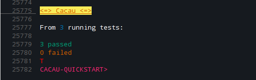

# cacau

<p align="center">
  
</p>

### _Corredor de teste em Common Lisp._

Leia em outras linguagens: [English](https://github.com/noloop/cacau/blob/master/README.md), [Portuguese-br](https://github.com/noloop/cacau/blob/master/README.pt-br.md)

## Começando na cacau

### Portabilidade

Testei apenas no Linux usando o SBCL, em breve irei providenciar testes nas 
demais plataformas utilizando alguma ferramente CI.

### Dependências

[:eventbus](https://github.com/noloop/eventbus)
[:assertion-error](https://github.com/noloop/assertion-error)

### Download e Load

**1 - Carregue o sistema cacau com o quicklisp**

```
IN PROGRESS...
```

**2 - Baixe e carregue o sistema cacau com o github e asdf**

download do github:

```
git clone https://github.com/noloop/cacau.git
```

e carregue com o asdf:

```lisp
(asdf:load-system :cacau)
```

**Nota: Lembre-se de configurar o asdf para procurar o diretório onde você está guardando seus sistemas, para que o asdf consiga
carregá-los corretamente, você pode saber mais aqui:  https://common-lisp.net/project/asdf/asdf/Configuring-ASDF-to-find-your-systems.html ou https://lisp-lang.org/learn/writing-libraries.**_

## Começo rápido

```lisp
(defpackage #:cacau-examples-quickstart
  (:use #:common-lisp
        #:assert-p
        #:cacau))
(in-package #:cacau-examples-quickstart)

(deftest "Test-1" () (eql-p 1 1))
(deftest "Test-2" () (eql-p 2 2))
(deftest "Test-3" () (eql-p 3 3))

(run :colorful t)
```
E você terá a saída do repórter `:min` que é o padrão da cacau:



Também há outros repórteres.

Perceba que a cacau retornou `T`, isso acontece porque nenhum teste falhou, 
quando há testes falhando ela retorna `NIL`.

## Asserções

A cacau foi construída para ser indenpendente de sistemas de asserção, é
verdade que no Common Lisp não temos muitos sistemas de asserção, mas 
estou tentando com a cacau criar esse padrão para que possa facilitar o uso
de um mesmo sistema de asserção em diferentes sistemas corredores de testes. 
Assim o usuário fica livre para escolher o que lhe agrada mais. 
Eu construí o sistema de asserção [:assert-p](https://github.com/noloop/assert-p),
e no exemplo [quickstart](examples/cacau-examples-quickstart.lisp) eu utilizo os dos sistemas 
em conjuto para criar meus testes.

É simples, existe o sistema corredo de teste `:cacau` e o sistema de asserção `:assert-p`,
quando uma asserção falha é lançado um 
[:assertion-error](https://github.com/noloop/assertion-error) que é capturado
e armazenado pela cacau para entregar o resultado final da corrida dos testes.

Com isso fica fácil surgir novos sistemas de asserção para casos específicos ou 
visando sintaxes diferentes, quais a cacau conseguirá trabalhar.

## Funcionalidades

### Suítes

Você pode organizar seus testes em suites:

```lisp
(defpackage #:cacau-examples-suites
  (:use #:common-lisp
        #:assert-p
        #:cacau))
(in-package #:cacau-examples-suites)

(defsuite :suite-1 ()
  (deftest "Test-1" () (t-p t))
  (deftest "Test-2" () (t-p t)))

(defsuite :suite-2 ()
  (let ((x 0))
    (deftest "Test-1" () (eql-p x 0))
    (deftest "Test-2" () (t-p t))
    (defsuite :suite-3 ()
      (deftest "Test-1" () (t-p t))
      (deftest "Test-2" () (t-p t)))))

(run)
```
O corredor de testes cacau possui uma `:suite-root`, então sempre que você 
chamar a função `(run)` um novo corredor é criado com uma nova `:suite-root`. 

### Ganchos

A ordem de execução dos ganchos segue a ordem dos tópicos abaixo, 
sendo assim é executado:

1. before-all hook
2. before-each hook
3. after-each hook
4. after-all hook

#### antes de todos

Faça algo antes de todos os testes de uma suíte.

```lisp
(defpackage #:cacau-examples-hooks
  (:use #:common-lisp
        #:assert-p
        #:cacau))
(in-package #:cacau-examples-hooks)

(defsuite :suite-with-before-all ()
  (let ((x 0))
    (defbefore-all "Before-all" () (setf x 1))
    (deftest "Test-1" () (eql-p x 1))
    (deftest "Test-2" () (eql-p x 1))))
    
(run)
```

#### antes de cada teste

Faça algo antes de cada teste de uma suíte.

```lisp
(defpackage #:cacau-examples-hooks
  (:use #:common-lisp
        #:assert-p
        #:cacau))
(in-package #:cacau-examples-hooks)

(defsuite :suite-with-before-each ()
  (let ((x 0))
    (defbefore-each "Before-each" () (setf x 1))
    (deftest "Test-1" () (eql-p x 1))
    (deftest "Test-2" () (eql-p x 1))))
    
(run)
```

#### depois de cada teste

Faça algo depois de cada teste de uma suíte.

```lisp
(defpackage #:cacau-examples-hooks
  (:use #:common-lisp
        #:assert-p
        #:cacau))
(in-package #:cacau-examples-hooks)

(defsuite :suite-with-after-each ()
  (let ((x 0))
    (defafter-each "After-each" () (setf x 1))
    (deftest "Test-1" () (eql-p x 0))
    (deftest "Test-2" () (eql-p x 1))))
    
(run)
```

#### depois de todos

Faça algo depois de todos os testes de uma suíte.

```lisp
(defpackage #:cacau-examples-hooks
  (:use #:common-lisp
        #:assert-p
        #:cacau))
(in-package #:cacau-examples-hooks)

(defsuite :suite-with-after-all ()
  (let ((x 0))
    (defafter-all "After-all" () (setf x 1))
    (deftest "Test-1" () (eql-p x 0))
    (deftest "Test-2" () (eql-p x 0))))
    
(run)
```
#### Ganchos na :suite-root

Para utilizar ganhos na `:suite-root` é tão simples quanto chamar as funções 
de ganchos sem estarem dentro de alguma suite:

```lisp
(defpackage #:cacau-examples-hooks
  (:use #:common-lisp
        #:assert-p
        #:cacau))
(in-package #:cacau-examples-hooks)

(defbefore-all "Before-all" () (print ":suite-root's before-all"))
(defbefore-each "Before-each" () (print ":suite-root's before-each"))
(defafter-each "After-each" () (print ":suite-root's after-each"))
(defafter-all "After-all" () (print ":suite-root's after-all"))

(defsuite :suite-1 ()
  (deftest "Test-1" () (t-p t))
  (deftest "Test-2" () (t-p t)))
  
(run)
```

Para entender melhor veja o arquivo de [exemplo de ganchos](examples/cacau-examples-hooks.lisp).

### Only e Skip

Você pode querer rodar alguns testes isoladamente ou então pular alguns testes por 
algum tempo. Com a cacau você pode fazer isso, e tanto isolar/pular suites ou testes.

#### correndo testes e suítes isoladamente

```lisp
(defpackage #:cacau-examples-onlys
  (:use #:common-lisp
        #:assert-p
        #:cacau))
(in-package #:cacau-examples-onlys)

(defsuite :suite-1 ()
  (deftest "Test-1" (:only) (t-p t))
  (deftest "Test-2" () (t-p t)))

(defsuite :suite-2 ()
  (let ((x 0))
    (deftest "Test-1" () (eql-p x 0))
    (deftest "Test-2" () (t-p t))
    (defsuite :suite-3 (:only)
      (deftest "Test-1" () (t-p t))
      (deftest "Test-2" () (t-p t)))))

(run)
```
Com o código acima 3 testes são executados, o "Test-1" da "Suite-1", 
e ambos os testes da "Suite-3".

#### pulando testes e suítes

```lisp
(defpackage #:cacau-examples-skips
  (:use #:common-lisp
        #:assert-p
        #:cacau))
(in-package #:cacau-examples-skips)

(defsuite :suite-1 ()
  (deftest "Test-1" (:skip) (t-p t))
  (deftest "Test-2" () (t-p t)))

(defsuite :suite-2 (:skip)
  (let ((x 0))
    (deftest "Test-1" () (eql-p x 0))
    (deftest "Test-2" () (t-p t))
    (defsuite :suite-3 ()
      (deftest "Test-1" () (t-p t))
      (deftest "Test-2" () (t-p t)))))

(run :colorful t)
```

Com o código acima apenas o "Test-2" da "Suite-1" é executado.

#### ordem de precedência "skip -> only"

A regra é simples:

Testes ou suites `skip` possuem precedência aos testes ou suites `only`.
Veja um exemplo:

```lisp
(defpackage #:cacau-examples-skips-onlys-rules
  (:use #:common-lisp
        #:assert-p
        #:cacau))
(in-package #:cacau-examples-skips-onlys-rules)

(defsuite :suite-1 (:only)
  (deftest "Test-1" () (t-p t)) ;; run!
  (deftest "Test-2" () (t-p t)) ;; run!
  (defsuite :suite-2 (:skip)
    (deftest "Test-1" () (t-p t))
    (deftest "Test-2" () (t-p t))))
(run :colorful t)
```

Você pode querer olhar para o arquivo de 
[exemplos da regra skip->only](examples/cacau-examples-skips-onlys-rules.lisp)
para melhor compreensão.

### Testes com Timeout

Você também pode determinar um tempo limite para seus testes, suites e ganchos. Leia atentamente
os tópicos abaixo, pois existem diferenças entre as três possiblidades.

#### definindo timeout nas suítes

Ao definir um timeout para uma suite, isso fará com que todos os testes daquela suite tenham 
o mesmo timeout que foi definido para a mesma.

```lisp

```

#### definindo timeout nas ganchos

Ao definir um `timeout` para um gancho, esse tempo limite só importará para o gancho configurado.

```lisp

```

#### definindo timeout nas testes

Ao definir um `timeout` para um teste, esse tempo limite só importará para o teste configurado. 
E se caso o teste estiver dentro de alguma suite que já tenha sido configurada com um `timeout`, 
o mesmo é ignorado, e o que predomina é o `timeout` do teste que foi configurado.

```lisp

```

### Testando código assíncrono

```lisp

```

### Interfaces

#### cl

```lisp

```

#### bdd

```lisp

```

#### tdd

```lisp

```

#### no-spaghetti

```lisp

```

### Repórteres 

#### min

```lisp

```

#### list

```lisp

```

#### full

```lisp

```

### Cacau com cores

```lisp

```

### Ativando o cl-debugger

```lisp

```

## Cacau com cores no SLIME

1. Copiar arquivo slime-repl-ansi-color.el

Você irá precisar copiar o arquivo 
[slime-repl-ansi-color.el](https://github.com/noloop/cacau/blob/master/contrib/slime-repl-ansi-color/slime-repl-ansi-color.el) 
para o diretório "contrib" do slime, algo como "~/.emacs.d/site-lisp/slime/contrib/", isso irá
depender de como está configurado o seu emacs + slime.

2. Configurar seu arquivo .emacs 

Adicione a seguinte linha no arquivo de configuração do seu emacs:

```lisp
(slime-setup '(slime-repl-ansi-color))
```

Isso também irá depender de como você configurou seu emacs.

3. Ative/desative slime-repl-ansi

Para ativar:

```lisp
(slime-repl-ansi-on)
```

Para desativar:

```lisp
(slime-repl-ansi-off)
```

E na cacau você só precisa chamar `run` com a key `:colorful` configurada para `t`:

```lisp
(cacau:run :colorful t)
```

## Integração ASDF

## Contribuindo

A cacau foi construída de maneira visando facilitar adicionar novas 
funcionalidades, como também escrever novas interfaces ou repórteres.
Se você tem um idéia nova para torná-la melhor, ou encontrou algum bug,
não deixe de abrir uma nova [questão](https://github.com/noloop/cacau/issues). 

## TODO

## API

function **(lib-function-name args)**

### LICENSE

Copyright (C) 2019 noloop

This program is free software: you can redistribute it and/or modify
it under the terms of the GNU General Public License as published by
the Free Software Foundation, either version 3 of the License, or
(at your option) any later version.

This program is distributed in the hope that it will be useful,
but WITHOUT ANY WARRANTY; without even the implied warranty of
MERCHANTABILITY or FITNESS FOR A PARTICULAR PURPOSE.  See the
GNU General Public License for more details.

You should have received a copy of the GNU General Public License
along with this program.  If not, see <https://www.gnu.org/licenses/>.

Contact author:

noloop@zoho.com

