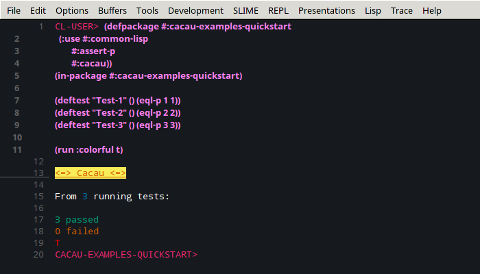
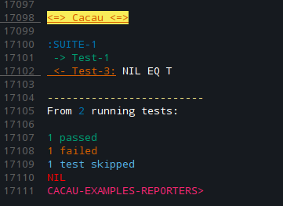

# cacau
 
<p align="center">
  
</p>

## <a name="read-in-other-languages">Leia em outros idiomas</a>

Leia em outras linguagens: [English](https://github.com/noloop/cacau/blob/master/README.md),
[Portuguese-br](https://github.com/noloop/cacau/blob/master/README.pt-br.md)

## <a name="quickstart">Começo rápido</a>

```lisp
(defpackage #:cacau-examples-quickstart
  (:use #:common-lisp
        #:assert-p
        #:cacau))
(in-package #:cacau-examples-quickstart)

(deftest "Test-1" () (eql-p 1 1))
(deftest "Test-2" () (eql-p 2 2))
(deftest "Test-3" () (eql-p 3 3))

(run :colorful t)
```
E você terá a saída do repórter `:min` que é o padrão da cacau:



Também há outros [repórteres](#reporters).

Perceba que a cacau retornou `T`, isso acontece porque nenhum teste falhou, 
quando há testes falhando ou erros (erros de ganchos por exemplo) ela retorna `NIL`.

## <a name="getting-started">Começando na cacau</a>

### <a name="summary">Sumário</a>
* [cacau](#cacau)
  * [Leia em outros idiomas](#read-in-other-languages)
  * [Começo rápido](#quickstart)
  * [Começando na cacau](#getting-started)
    * [Sumário](#summary)
    * [Portabilidade](#portability)
    * [Dependências](#dependencies)
    * [Download e Load](#download-and-load)
    * [Funcionalidades](#functionalities)
      * [Suítes](#suites)
      * [Ganchos](#hooks)
        * [antes de todos](#before-all)
        * [antes de cada teste](#before-each)
        * [depois de cada teste](#after-each)
        * [depois de todos](#after-all)
        * [ganchos na :suite-root](#hooks-in-suite-root)
        * [herança de ganchos antes/depois de cada teste](#before-after-each-inheritance)
      * [Only e Skip](#only-and-skip)
        * [correndo testes e suítes isoladamente](#onlys)
        * [pulando testes e suítes](#skips)
        * [ordem de precedência "skip -> only"](#skip-only-rules)
      * [Timeout](#timeout)
        * [definindo timeout nas suítes](#timeout-suites)
        * [definindo timeout nos ganchos](#timeout-hooks)
        * [definindo timeout nos testes](#timeout-tests)
      * [Testando código assíncrono](#async-test)
      * [Interfaces](#interfaces)
        * [cl](#cl)
        * [bdd](#bdd)
        * [tdd](#tdd)
        * [no-spaghetti](#no-spaghetti)
      * [Cacau com cores](#cacau-with-colors)
      * [Repórteres](#reporters)
        * [min](#min)
        * [list](#list)
        * [full](#full)
      * [Ativando o cl-debugger](#enabling-cl-debugger)
      * [Ganchos run](#run-hooks)
  * [Cacau com cores no SLIME](#cacau-with-colors-in-slime)
  * [Integração ASDF](#asdf-integration)
  * [Contribuindo](#contributing)
  * [TODO](#todo)
  * [API](#api)
  * [LICENÇA](#license)

### <a name="portability">Portabilidade</a>

Testei apenas no Linux usando o SBCL, em breve irei providenciar testes 
nas demais plataformas utilizando alguma ferramente CI.

### <a name="dependencies">Dependências</a>

[:eventbus](https://github.com/noloop/eventbus)
[:assertion-error](https://github.com/noloop/assertion-error)

### <a name="download-and-load">Download e Load</a>

**1 - Carregue o sistema cacau com o quicklisp**

```
IN PROGRESS...
```

**2 - Baixe e carregue o sistema cacau com o github e asdf**

download do github:

```
git clone https://github.com/noloop/cacau.git
```

e carregue com o asdf:

```lisp
(asdf:load-system :cacau)
```

**Nota: Lembre-se de configurar o asdf para procurar o diretório onde você está guardando seus sistemas, para que o asdf consiga
carregá-los corretamente, você pode saber mais aqui:**

https://common-lisp.net/project/asdf/asdf/Configuring-ASDF-to-find-your-systems.html 

**ou**

https://lisp-lang.org/learn/writing-libraries

## <a name="assertions">Asserções</a>

A cacau foi construída para ser indenpendente de sistemas de asserção, é
verdade que no Common Lisp não temos muitos sistemas de asserção, mas 
estou tentando com a cacau criar esse padrão para que possa facilitar o uso
de um mesmo sistema de asserção em diferentes sistemas corredores de testes. 
Assim o usuário fica livre para escolher o que lhe agrada mais. 
Eu construí o sistema de asserção [:assert-p](https://github.com/noloop/assert-p),
e no exemplo [quickstart](examples/cacau-examples-quickstart.lisp) eu utilizo os dois sistemas 
em conjuto para criar os testes.

É simples, existe o sistema corredo de teste `:cacau` e o sistema de asserção `:assert-p`,
quando uma asserção falha é lançado um 
[:assertion-error](https://github.com/noloop/assertion-error) que é capturado
e armazenado pela cacau para entregar o resultado final da corrida dos testes.

Com isso fica fácil surgir novos sistemas de asserção para casos específicos ou 
visando sintaxes diferentes, quais a cacau conseguirá trabalhar.

## <a name="functionalities">Funcionalidades</a>

### <a name="suites">Suítes</a>

Você pode organizar seus testes em suites:

```lisp
(defpackage #:cacau-examples-suites
  (:use #:common-lisp
        #:assert-p
        #:cacau))
(in-package #:cacau-examples-suites)

(defsuite :suite-1 ()
  (deftest "Test-1" () (t-p t))
  (deftest "Test-2" () (t-p t)))

(defsuite :suite-2 ()
  (let ((x 0))
    (deftest "Test-1" () (eql-p x 0))
    (deftest "Test-2" () (t-p t))
    (defsuite :suite-3 ()
      (deftest "Test-1" () (t-p t))
      (deftest "Test-2" () (t-p t)))))

(run)
```
O corredor de testes cacau possui uma `:suite-root`, então sempre que você 
chamar a função `(run)` um novo corredor é criado com uma nova `:suite-root`. 

### <a name="hooks">Ganchos</a>

A ordem de execução dos ganchos segue a ordem dos tópicos abaixo, 
sendo assim é executado:

1. before-all hook
2. before-each hook
3. after-each hook
4. after-all hook

#### <a name="before-all">antes de todos</a>

Faça algo antes de todos os testes de uma suíte.

```lisp
(defpackage #:cacau-examples-hooks
  (:use #:common-lisp
        #:assert-p
        #:cacau))
(in-package #:cacau-examples-hooks)

(defsuite :suite-with-before-all ()
  (let ((x 0))
    (defbefore-all "Before-all" () (setf x 1))
    (deftest "Test-1" () (eql-p x 1))
    (deftest "Test-2" () (eql-p x 1))))
    
(run)
```

#### <a name="before-each">antes de cada teste</a>

Faça algo antes de cada teste de uma suíte.

```lisp
(defpackage #:cacau-examples-hooks
  (:use #:common-lisp
        #:assert-p
        #:cacau))
(in-package #:cacau-examples-hooks)

(defsuite :suite-with-before-each ()
  (let ((x 0))
    (defbefore-each "Before-each" () (setf x 1))
    (deftest "Test-1" () (eql-p x 1))
    (deftest "Test-2" () (eql-p x 1))))
    
(run)
```

#### <a name="after-each">depois de cada teste</a>

Faça algo depois de cada teste de uma suíte.

```lisp
(defpackage #:cacau-examples-hooks
  (:use #:common-lisp
        #:assert-p
        #:cacau))
(in-package #:cacau-examples-hooks)

(defsuite :suite-with-after-each ()
  (let ((x 0))
    (defafter-each "After-each" () (setf x 1))
    (deftest "Test-1" () (eql-p x 0))
    (deftest "Test-2" () (eql-p x 1))))
    
(run)
```

#### <a name="after-all">depois de todos</a>

Faça algo depois de todos os testes de uma suíte.

```lisp
(defpackage #:cacau-examples-hooks
  (:use #:common-lisp
        #:assert-p
        #:cacau))
(in-package #:cacau-examples-hooks)

(defsuite :suite-with-after-all ()
  (let ((x 0))
    (defafter-all "After-all" () (setf x 1))
    (deftest "Test-1" () (eql-p x 0))
    (deftest "Test-2" () (eql-p x 0))))
    
(run)
```

#### <a name="hooks-in-suite-root">ganchos na :suite-root</a>

Para utilizar ganhos na `:suite-root` é tão simples quanto chamar as funções 
de ganchos sem estarem dentro de alguma suite:

```lisp
(defpackage #:cacau-examples-hooks
  (:use #:common-lisp
        #:assert-p
        #:cacau))
(in-package #:cacau-examples-hooks)

(defbefore-all "Before-all" () (print ":suite-root's before-all"))
(defbefore-each "Before-each" () (print ":suite-root's before-each"))
(defafter-each "After-each" () (print ":suite-root's after-each"))
(defafter-all "After-all" () (print ":suite-root's after-all"))

(defsuite :suite-1 ()
  (deftest "Test-1" () (t-p t))
  (deftest "Test-2" () (t-p t)))
  
(run)
```

#### <a name="before-after-each-inheritance">herança de ganchos antes/depois de cada teste</a>

Os ganchos que executam algo antes da suíte ou depois da suíte são executados apenas uma vez,
e apenas naquela suíte.

Já os ganchos que executam algo antes ou depois de cada teste serão herdados, por exemplo, 
se uma suíte pai de nome `:suite-1` tem um gancho para executar algo antes de cada 
teste, e essa suíte tem uma suíte filha `:suite-2`, que também possuí um gancho 
para executar algo antes dos testes, então, ao rodar os testes da `:suite-1` apenas o gancho
dela será executado, porém ao rodar os testes da `:suite-2`, será executado primeiro o gancho 
da suíte pai e depois o da suíte filha. Veja um exemplo para melhor entendimento:

```lisp
(defpackage #:cacau-examples-hooks
  (:use #:common-lisp
        #:assert-p
        #:cacau))
(in-package #:cacau-examples-hooks)

(defsuite :suite-1 ()
  (defbefore-each "Before-each Suite-1" ()
    (print "run Before-each Suite-1"))
  (deftest "Test-1" () (print "run Test-1") (t-p t))
  (defsuite :suite-1 ()
    (defbefore-each "Before-each Suite-2" ()
      (print "run Before-each Suite-2"))
    (deftest "Test-1" () (print "run Test-2") (t-p t))))
    
(run)
```

Isso irá imprimir:

```lisp
"run Before-each Suite-1" 
"run Test-1" 
"run Before-each Suite-1" 
"run Before-each Suite-2" 
"run Test-2" 
```

Para entender melhor veja o arquivo de [exemplo de ganchos](examples/cacau-examples-hooks.lisp).

Esteja atento que quando ganchos lançam erros com exceção do erro de timeout extrapolado, 
eles irão abortar a corrida dos testes e o resultado será dado. Isso acontece porque a 
cacau pensa que para que os testes rodem corretamente antes de tudo seus ganchos 
configurados devem rodar corretamente.

### <a name="only-and-skip">Only e Skip</a>

Você pode querer rodar alguns testes isoladamente ou então pular alguns testes por 
algum tempo. Com a cacau você pode fazer isso, e tanto isolar/pular suites ou testes.

#### <a name="onlys">correndo testes e suítes isoladamente</a>

```lisp
(defpackage #:cacau-examples-onlys
  (:use #:common-lisp
        #:assert-p
        #:cacau))
(in-package #:cacau-examples-onlys)

(defsuite :suite-1 ()
  (deftest "Test-1" (:only) (t-p t))
  (deftest "Test-2" () (t-p t)))

(defsuite :suite-2 ()
  (let ((x 0))
    (deftest "Test-1" () (eql-p x 0))
    (deftest "Test-2" () (t-p t))
    (defsuite :suite-3 (:only)
      (deftest "Test-1" () (t-p t))
      (deftest "Test-2" () (t-p t)))))

(run)
```

Com o código acima 3 testes são executados: O "Test-1" da "Suite-1", 
e ambos os testes da "Suite-3".

#### <a name="skips">pulando testes e suítes</a>

```lisp
(defpackage #:cacau-examples-skips
  (:use #:common-lisp
        #:assert-p
        #:cacau))
(in-package #:cacau-examples-skips)

(defsuite :suite-1 ()
  (deftest "Test-1" (:skip) (t-p t))
  (deftest "Test-2" () (t-p t)))

(defsuite :suite-2 (:skip)
  (let ((x 0))
    (deftest "Test-1" () (eql-p x 0))
    (deftest "Test-2" () (t-p t))
    (defsuite :suite-3 ()
      (deftest "Test-1" () (t-p t))
      (deftest "Test-2" () (t-p t)))))

(run :colorful t)
```

Com o código acima apenas o "Test-2" da "Suite-1" é executado.

#### <a name="skip-only-rules">ordem de precedência "skip -> only"</a>

A regra é simples:

Testes ou suites `skip` possuem precedência aos testes ou suites `only`.
Veja um exemplo:

```lisp
(defpackage #:cacau-examples-skips-onlys-rules
  (:use #:common-lisp
        #:assert-p
        #:cacau))
(in-package #:cacau-examples-skips-onlys-rules)

(defsuite :suite-1 (:only)
  (deftest "Test-1" () (t-p t)) ;; run!
  (deftest "Test-2" () (t-p t)) ;; run!
  (defsuite :suite-2 (:skip)
    (deftest "Test-1" () (t-p t))
    (deftest "Test-2" () (t-p t))))
(run :colorful t)
```

Você pode querer olhar para o arquivo de 
[exemplos da regra skip->only](examples/cacau-examples-skips-onlys-rules.lisp)
para melhor compreensão.

### <a name="timeout">Timeout</a>

Você também pode determinar um tempo limite para seus testes, suítes e ganchos. Leia atentamente
os tópicos abaixo, pois existem diferenças entre as três possibilidades.

#### <a name="timeout-suites">definindo timeout nas suítes</a>

Ao definir um timeout para uma suite, isso fará com que todos os testes daquela suite tenham 
o mesmo timeout que foi definido nela.

```lisp
(defpackage #:cacau-examples-timeout
  (:use #:common-lisp
        #:assert-p
        #:cacau))
(in-package #:cacau-examples-timeout)

(defsuite :suite-1 ((:timeout 0))
  (deftest "Test-1" () (t-p t)) ;; Timeout Error: Time(0) extrapolated!
  (deftest "Test-2" () (t-p t))) ;; Timeout Error: Time(0) extrapolated!
  
(run)
```

#### <a name="timeout-hooks">definindo timeout nos ganchos</a>

Ao definir um timeout para um gancho, esse tempo limite só importará para o gancho configurado.
Quando houver falha de timeout nos ganchos a corrida dos testes não será 
abortada, como acontece quando ganchos falham por lançamentos de 
qualquer outro erro.

```lisp
(defpackage #:cacau-examples-timeout
  (:use #:common-lisp
        #:assert-p
        #:cacau))
(in-package #:cacau-examples-timeout)

(defsuite :suite-1 ()
  (defbefore-all "Before-all" ((:timeout 0))) ;; Timeout Error: Time(0) extrapolated!
  (deftest "Test-1" () (t-p t))
  (deftest "Test-2" () (t-p t)))
          
(run)
```

#### <a name="timeout-tests">definindo timeout nos testes</a>

Ao definir um timeout para um teste, esse tempo limite só importará para o teste configurado. 
Quando houver falha de timeout a corrida dos testes não será abortada.

```lisp
(defpackage #:cacau-examples-timeout
  (:use #:common-lisp
        #:assert-p
        #:cacau))
(in-package #:cacau-examples-timeout)

(defsuite :suite-1 ()
  (deftest "Test-1" ((:timeout 0)) (t-p t)) ;; Timeout Error: Time(0) extrapolated!
  (deftest "Test-2" () (t-p t)))

(run)
```

E se caso o teste ou suíte estiver dentro de alguma suite que já tenha sido configurada com 
um timeout, o mesmo é ignorado, e o que predomina é o timeout do teste ou suíte 
filho que foi configurado.

```lisp
(defpackage #:cacau-examples-timeout
  (:use #:common-lisp
        #:assert-p
        #:cacau))
(in-package #:cacau-examples-timeout)

(defsuite :suite-1 ((:timeout 0))
  (deftest "Test-1" () (t-p t))   ;; Timeout Error: Time(0) extrapolated!
  (deftest "Test-2" () (t-p t))   ;; Timeout Error: Time(0) extrapolated!
  (defsuite :suite-2 ((:timeout 50000))
    (deftest "Test-1" ((:timeout 0)) (t-p t)) ;; Timeout Error: Time(0) extrapolated!
    (deftest "Test-2" () (t-p t))))

(run)
```

Você pode querer olhar para o arquivo de 
[exemplos de timeout](examples/cacau-examples-timeout.lisp)
para melhor compreensão.

### <a name="async-test">Testando código assíncrono</a>

Você pode precisar testar algum código assíncrono, e a cacau foi construída de maneira a 
aguardar cada teste antes da execução do próximo. Você precisará chamar uma função `done` 
e também dizer a cacau o teste ou gancho que é assíncrono. Veja um exemplo de como escrever 
um teste para testar seu código assíncrono:

```lisp
(defpackage #:cacau-examples-async-test
  (:use #:common-lisp
        #:assert-p
        #:cacau))
(in-package #:cacau-examples-async-test)

(defsuite :suite-1 ()
  (deftest "Test-1" ((:async done))
    (funcall done))
  (deftest "Test-2" () (t-p t)))
  
  (run)
```

Acima é configurado um teste passando `(:async done)` em suas configurações, onde `done` é o nome da 
função que você precisa chamar para o teste ser finalizado, você pode chamar `done` de qualquer nome 
que desejar como, por exemplo:

```lisp
(deftest "Test-1" ((:async something))
    (funcall something))
```

Esteja atento que se você não chamar `done` ou o nome que escolheu, a cacau esperará eternamente por 
essa chamada, então você não vai querer esquecer de chamar `done` para finalizar seu teste.

Pode ser passado 3 tipos de argumentos diferentes para a função `done`, ela aceita um 
`assertion-error`, um `error`, ou uma `lambda`. Isso é útil para você capturar erros de asserção, 
um exemplo, passando um `assertion-error`:

```lisp
(defpackage #:cacau-examples-async-test
  (:use #:common-lisp
        #:assert-p
        #:cacau))
(in-package #:cacau-examples-async-test)

(deftest "Test-1" ((:async done))
      (handler-case (t-p nil)
        (error (c)
          (funcall done c))))
          
 (run)
```

Ou passando uma função `lambda` onde você pode chamar funções de asserção que serão capturadas 
pela cacau, como nos testes para testar coisas síncronas:

```lisp
(defpackage #:cacau-examples-async-test
  (:use #:common-lisp
        #:assert-p
        #:cacau))
(in-package #:cacau-examples-async-test)

(deftest "Test-2" ((:async done))
      (funcall done (lambda () (t-p t))))
          
 (run)
``` 

Você pode querer olhar para o arquivo de 
[exemplos de testes assíncronos](examples/cacau-examples-async-test.lisp)
para melhor compreensão.

### <a name="interfaces">Interfaces</a>

A cacau foi construída a suportar a criação de novas interfaces, assim você poderá usar a que mais te 
agradar, ou até mesmo contribuir com o projeto cacau criando uma nova interface.

Você não precisa configurar nada ou passar nada ao chamar `(run)` para usar uma interface, todas 
estão disponíveis para você utilizar a que preferir, e pode até misturar elas, mas não aconselho 
fazer isso, mantenha um padrão, e utilize apenas uma, para melhor legibilidade do código.

#### <a name="cl">cl</a>

Essa interface é a que foi utilizada nos exemplos acima. Ela funciona definindo suítes no corpo de outras suítes,
e fornece as macros:

```lisp
(defsuite name options &body body)
(defbefore-all name options &body body)
(defbefore-each name options &body body)
(defafter-each name options &body body)
(defafter-all name options &body body)
(deftest name options &body body)
```

O parâmetro `options` recebe uma lista que pode ter zero ou mais dos seguintes itens, nos ganchos:

```lisp
((:async done) (:timeout 0))
```

em `defsuite` ou `deftest`:

```lisp
(:skip :only (:async done) (:timeout 0))
```

Veja um exemplo de uso:

```lisp
(defpackage #:cacau-examples-interfaces
  (:use #:common-lisp
        #:assert-p
        #:cacau))
(in-package #:cacau-examples-interfaces)
  
(defsuite :suite-1 ()
  (let ((x 0))
    (defbefore-all "Before-all Suite-1" () (setf x 1))
    (defbefore-each "Before-each Suite-1" () (setf x 0))
    (defafter-each "After-each Suite-1" () (setf x 1))
    (defafter-all "After-all Suite-1" ((:async done))
      (setf x 1)
      (funcall done))
    (deftest "Test-1" () (eql-p x 0))
    (deftest "Test-2" ()
      (funcall done (lambda () (eql-p x 0))))))

(run)
```

#### <a name="bdd">bdd</a>

Ela funciona definindo suíte no corpo de outra suíte, porém não é fornecido macros, 
e sim funções que necessitam do uso de `lambda`.

```lisp
(before-all name fn &key async (timeout -1))
(before-each name fn &key async (timeout -1))
(after-each name fn &key async (timeout -1))
(after-all name fn &key async (timeout -1))
(context name fn &key only skip (timeout -1))
(it name fn &key async only skip (timeout -1))
```

Veja um exemplo de uso:

```lisp
(defpackage #:cacau-examples-interfaces
  (:use #:common-lisp
        #:assert-p
        #:cacau))
(in-package #:cacau-examples-interfaces)

(context
 "Suite-1"
 (lambda (&optional (x 0))
   (before-all "Before-all Suite-1" (lambda () (setf x 1)))
   (before-each "Before-each Suite-1" (lambda () (setf x 1)))
   (after-each "After-each Suite-1" (lambda () (setf x 1)))
   (after-all "After-all Suite-1" (lambda (done) (funcall done)) :async t)
   (it "Test-1" (lambda () (eql-p x 1)))
   (it "Test-2" (lambda () (incf x) (eql-p x 2)))
   (context
    "Suite-2"
    (lambda (&optional (x 0))
      (it "Test-1" (lambda () (incf x) (eql-p x 1)))
      (it "Test-2" (lambda () (eql-p x 1)))))))
      
(run)
```

#### <a name="tdd">tdd</a>

Esta interface funciona definindo suítes no corpo de outras suítes, 
porém não é fornecido macros, e sim funções que necessitam do 
uso de `lambda`.

```lisp
(suite-setup name fn &key async (timeout -1))
(suite-teardown name fn &key async (timeout -1))
(test-setup name fn &key async (timeout -1))
(test-teardown name fn &key async (timeout -1))
(suite name fn &key only skip (timeout -1))
(test name fn &key async only skip (timeout -1))
```

Veja um exemplo de uso:

```lisp
(defpackage #:cacau-examples-interfaces
  (:use #:common-lisp
        #:assert-p
        #:cacau))
(in-package #:cacau-examples-interfaces)

(suite
 "Suite-1"
 (lambda (&optional (x 0))
   (suite-setup "Suite-setup Suite-1" (lambda () (setf x 1)))
   (test-setup "Test-setup Suite-1" (lambda () (setf x 1)))
   (test-teardown "Test-teardown Suite-1" (lambda () (setf x 1)))
   (suite-teardown "Suite-teardown Suite-1" (lambda (done) (funcall done)) :async t)
   (test "Test-1" (lambda () (eql-p x 1)))
   (test "Test-2" (lambda () (incf x) (eql-p x 2)))
   (suite
    "Suite-2"
    (lambda (&optional (x 0))
      (test "Test-1" (lambda () (incf x) (eql-p x 1)))
      (test "Test-2" (lambda () (eql-p x 1)))))))
      
(run)
```

#### <a name="no-spaghetti">no-spaghetti</a>

Esta interface funciona sem definir suíte no corpo de outra suíte, 
ela trabalha de modo serial e fornece as seguintes macros:

```lisp
(defbefore-plan name options &body body)
(defbefore-t name options &body body)
(defafter-t name options &body body)
(defafter-plan name options &body body)
(in-plan name &optional (options ()))
(deft name &optional (options ()))
```

O parâmetro `options` recebe uma lista que pode ter zero ou mais dos seguintes itens, nos ganchos:

```lisp
((:async done) (:timeout 0))
```

em `in-plan`:

```lisp
(:skip :only (:async done) (:timeout 0) (:parent :suite-name))
```

e em `deft`:

```lisp
(:skip :only (:async done) (:timeout 0))
```

Isso funciona assim para evitar que você precise especificar quem é a suíte pai de 
cada de teste que escrever, ao chamar `in-plan`, todas as seguintes chamadas de `deft` ou chamadas de 
ganchos terão esta suíte como pai, até você chamar outro `in-plan`.

Veja um exemplo de uso:

```lisp
(defpackage #:cacau-examples-interfaces
  (:use #:common-lisp
        #:assert-p
        #:cacau))
(in-package #:cacau-examples-interfaces)

(let ((x 0))
  (in-plan :suite-1 ()) ;; or (in-suite :suite-1 ((:parent :suite-root)))
  (defbefore-plan :before-plan-suite-1 () (setf x 1))
  (deft :test-1 () (eql-p x 1))
  (deft :test-2 ((:async done))
    (incf x)
    (funcall done (lambda () (eql-p x 2))))

  (in-plan :suite-2 ((:parent :suite-1)))
  (defafter-plan :after-plan-suite-2 ((:async done-hook)) (setf x 1) (funcall done-hook))
  (deft :test-1 () (eql-p x 2))
  (deft :test-2 () (incf x) (eql-p x 3))

  (in-plan :suite-3 ((:parent :suite-2)))
  (defbefore-t :before-t-suite-3 () (setf x 0))
  (deft :test-1 () (incf x) (eql-p x 1))
  (deft :test-2 () (eql-p x 0))

  (in-plan :suite-4) ;; or (in-suite :suite-4 ((:parent :suite-root)))
  (defafter-t :after-t-suite-4 () (setf x 0))
  (deft :test-1 () (incf x) (eql-p x 2))
  (deft :test-2 () (eql-p x 0)))
  
  (run)
```

Você pode querer olhar para o arquivo de 
[exemplos de interfaces](examples/cacau-examples-interfaces.lisp)
para melhor compreensão.

### <a name="cacau-with-colors">Cacau com cores</a>

A cacau por padrão não entrega resultados coloridos, mas você pode 
ativar as cores na saída da cacau e ter um visualização colorida do resultado dos repórteres. 
Você precisa configurar a cacau passando o argumento key `:colorful` com o 
valor `t` para a função `(run)`, veja como:

```lisp
(run :colorful t)
```

#### <a name="reporters">Repórteres</a>

A cacau foi construída a suportar a criação de novos repórteres, assim você poderá usar o que mais te 
agradar, ou até mesmo contribuir com o projeto cacau criando um novo repórter.

Você precisa configurar o repórter que deseja utilizar passando para `(run)` a key `:reporter` 
configurada com o nome do repórter.

Irei apresentar os repórteres em ordem detalhes de suas saídas, do mais básico ao mais detalhado. 

#### <a name="min">min</a>

Esse repórter padrão da cacau, quando você chamar `(run)` sem especificar um repórter 
a cacau irá usar o repórter `:min`.

Este repórter mostra informações muito básicas, sua saída consiste em um epílogo 
dizendo a quantidade de testes rodados e quantos passaram e falharam.

Para o código:

```lisp
(defpackage #:cacau-examples-reporters
  (:use #:common-lisp
        #:assert-p
        #:cacau))
(in-package #:cacau-examples-reporters)

(defsuite :suite-1 ()
  (deftest "Test-1" () (t-p t))
  (deftest "Test-2" (:skip) (t-p t))
  (deftest "Test-3" () (t-p nil)))

(run :colorful t) ;; or (run :colorful t :reporter :min)
```

A saída será:


#### <a name="list">list</a>

Este repórter apresenta informações um pouco mais detalhas que o repórter `:min` 
ele lista as suítes e testes que estão sendo executadas, e por fim entrega um epílogo 
dizendo a quantidade de testes rodados e quantos passaram e falharam, porém ainda irá 
fornecer a quantidade de suítes e testes que foram configurados com `:skip`.

Para o código:

```lisp
(defpackage #:cacau-examples-reporters
  (:use #:common-lisp
        #:assert-p
        #:cacau))
(in-package #:cacau-examples-reporters)

(defsuite :suite-1 ()
  (deftest "Test-1" () (t-p t))
  (deftest "Test-2" (:skip) (t-p t))
  (deftest "Test-3" () (t-p nil)))

(run :colorful t :reporter :list)
```

A saída será:



#### <a name="full">full</a>

Este repórter apresenta informações um pouco mais detalhas que o repórter `:list` 
ele lista as suítes e testes que estão sendo executadas, e depois entrega um epílogo 
completo com todas as informações que a cacau possue da corrida dos testes, e por 
fim mostra os testes que falharam com as mensagens de erro, dando opção de
analisar o stack completo que levou até aquele erro.

Para o código:

```lisp
(defpackage #:cacau-examples-reporters
  (:use #:common-lisp
        #:assert-p
        #:cacau))
(in-package #:cacau-examples-reporters)

(defsuite :suite-1 ()
  (deftest "Test-1" () (t-p t))
  (deftest "Test-2" () (t-p t))
  (deftest "Test-3" () (t-p nil)))

(run :colorful t :reporter :full)
```

A saída será:


Você pode configurar a saída do repórter `:full` passando a key `:reporter-options` para `(run)` 
e com isso mostrar na ordem que quiser as informações, ou ocultar as que não deseja 
ver.

Para o código:

```lisp
(defsuite :suite-1 ()
  (deftest "Test-1" () (t-p t))
  (deftest "Test-2" () (t-p t))
  (deftest "Test-3" () (t-p nil)))

(run :colorful t
     :reporter :full
     :reporter-options
     '(:tests-list
       (:epilogue
        (:run-start
         :run-end
         :run-duration
         :running-suites
         :running-tests
         :passing
         :failing
         :errors))
       :stack))
```

A saída será:


Você pode querer olhar para o arquivo de 
[exemplos de repórteres](examples/cacau-examples-reporters.lisp)
para melhor compreensão.

### <a name="enabling-cl-debugger">Ativando o cl-debugger</a>

Se você quiser chamar o cl-debugger evitando que a cacau capture os erros, você pode fazer isso 
configurando a cacau passando a key `:cl-debugger` com o valor `t` para a função `(run)`, veja:

```lisp
(run :cl-debugger t)
```

### <a name="run-hooks">Ganchos run</a>

Caso precise executar algo antes ou depois da execução da função `(run)`, existem dois ganchos disponivéis 
para isso, você só precisar passar uma key para `(run)`:

```lisp
(run :before-run (lambda () (print "before-run")) 
            :after-run (lambda () (print "after-run"))) 
```

## <a name="cacau-with-colors-in-slime">Cacau com cores no SLIME</a>

A cacau utiliza os códigos de escape ANSI para imprimir suas saídas 
coloridas, e por padrão o SLIME não suportar isso.

Para ativar a utilização de cores ANSI no SLIME, você irá precisar seguir os seguintes passos abaixo:

**1. Copiar arquivo "slime-repl-ansi-color.el"**

Você irá precisar copiar o arquivo 
[slime-repl-ansi-color.el](https://github.com/noloop/cacau/blob/master/contrib/slime-repl-ansi-color/slime-repl-ansi-color.el) 
para o diretório "contrib" do SLIME, algo como "~/.emacs.d/site-lisp/slime/contrib/", isso irá
depender de como está configurado o seu EMACS + SLIME.

**2. Configurar seu arquivo ".emacs"**

Adicione a seguinte linha no arquivo de configuração do seu EMACS:

```lisp
(slime-setup '(slime-repl-ansi-color))
```

Isso também irá depender de como você configurou seu EMACS.

**3. Ative/desative slime-repl-ansi**

Para ativar:

```lisp
(slime-repl-ansi-on)
```

Para desativar:

```lisp
(slime-repl-ansi-off)
```

E por fim, na cacau você só precisa chamar `(run)` passando o 
argumento key `:colorful` configurada para `t`:

```lisp
(cacau:run :colorful t)
```

## <a name="asdf-integration">Integração ASDF</a>

Você pode querer chamar a cacau em seu sistema ASDF,
para conseguir isso, configure seu sistema de teste como mostrado abaixo:

```lisp
(defsystem :cacau-examples-asdf-integration-test
  :depends-on (:cacau-examples-asdf-integration
               :cacau
               :assert-p)
  :defsystem-depends-on (:cacau-asdf)
  :components ((:cacau-file "cacau-examples-asdf-integration-test"))
  :perform
  (test-op (op c)
           (progn
             (funcall (intern #.(string :run-cacau-asdf) :cacau) c)
             (symbol-call :cacau '#:run))))
```

Você pode querer olhar para o diretório de 
[exemplo de integração ASDF](examples/asdf-integration/)
para melhor compreensão.

## <a name="contributing">Contribuindo</a>

A cacau foi construída de maneira visando facilitar adicionar novas 
funcionalidades, como também escrever novas interfaces ou repórteres.
Se você tem um idéia nova para torná-la melhor, ou encontrou algum bug, 
ou deseja contribuir de qualquer outro modo não deixe de abrir 
uma nova [questão](https://github.com/noloop/cacau/issues). 

## <a name="todo">TODO</a>

* Providenciar testes nos demais compiladores/interpretadores CL utilizando alguma ferramente CI.
* Escrever testes unitários para as funções do kernel da cacau.

## <a name="api">API</a>

function **(context name fn &key only skip (timeout -1))** => suite

function **(before-all name fn &key (timeout -1))** => suite-before-all

function **(after-all name fn &key (timeout -1))** => suite-after-all

function **(before-each name fn &key (timeout -1))** => suite-before-each

function **(after-each name fn &key (timeout -1))** => suite-after-all

function **(it name fn &key only skip (timeout -1))** => test

function **(suite name fn &key only skip (timeout -1))** => suite

function **(suite-setup name fn &key (timeout -1))** => suite-before-all

function **(suite-teardown name fn &key (timeout -1))** => suite-after-all

function **(test-setup name fn &key (timeout -1))** => suite-before-each

function **(test-teardown name fn &key (timeout -1))** => suite-after-each

function **(test name fn &key only skip (timeout -1))** => test

macro **(defsuite name options &body body)** => suite

macro **(defbefore-all name options &body body)** => suite-before-all

macro **(defafter-all name options &body body)** => suite-after-all

macro **(defbefore-each name options &body body)** => suite-before-each

macro **(defafter-each name options &body body)** => suite-after-each

macro **(deftest name options &body body)** => test

macro **(in-plan name &optional (options ()))** => suite

macro **(defbefore-plan name options &body body)** => => suite-before-all

macro **(defafter-plan name options &body body)** => suite-after-all

macro **(defbefore-t name options &body body)** => suite-before-each

macro **(defafter-t name options &body body)** => suite-after-each

macro **(deft name options &body body)** => test

function **(run &key (reporter :min)
                   before-run
                   after-run
                   colorful
                   reporter-options
                   cl-debugger)** => result

### <a name="license">LICENÇA</a>

Copyright (C) 2019 noloop

This program is free software: you can redistribute it and/or modify
it under the terms of the GNU General Public License as published by
the Free Software Foundation, either version 3 of the License, or
(at your option) any later version.

This program is distributed in the hope that it will be useful,
but WITHOUT ANY WARRANTY; without even the implied warranty of
MERCHANTABILITY or FITNESS FOR A PARTICULAR PURPOSE.  See the
GNU General Public License for more details.

You should have received a copy of the GNU General Public License
along with this program.  If not, see <https://www.gnu.org/licenses/>.

Contact author:

noloop@zoho.com

